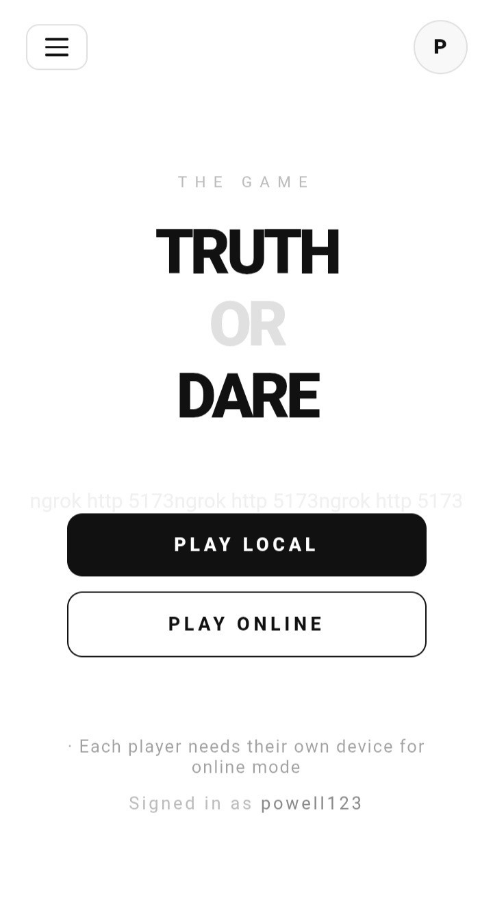
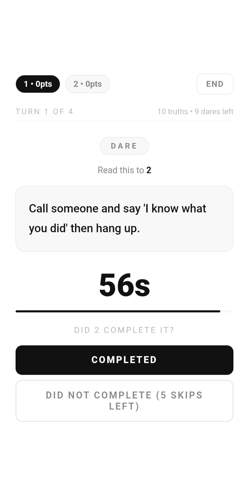
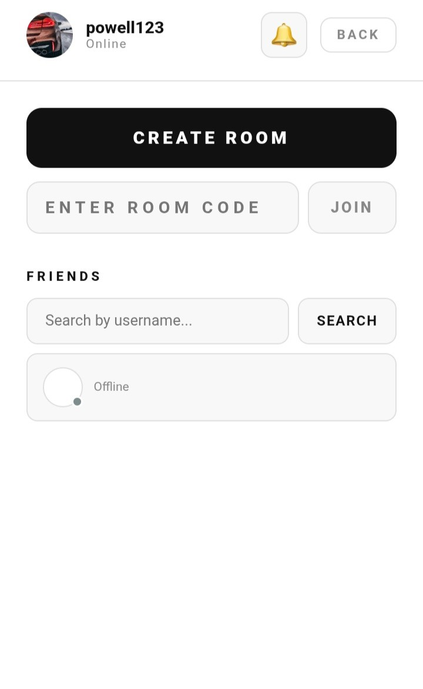
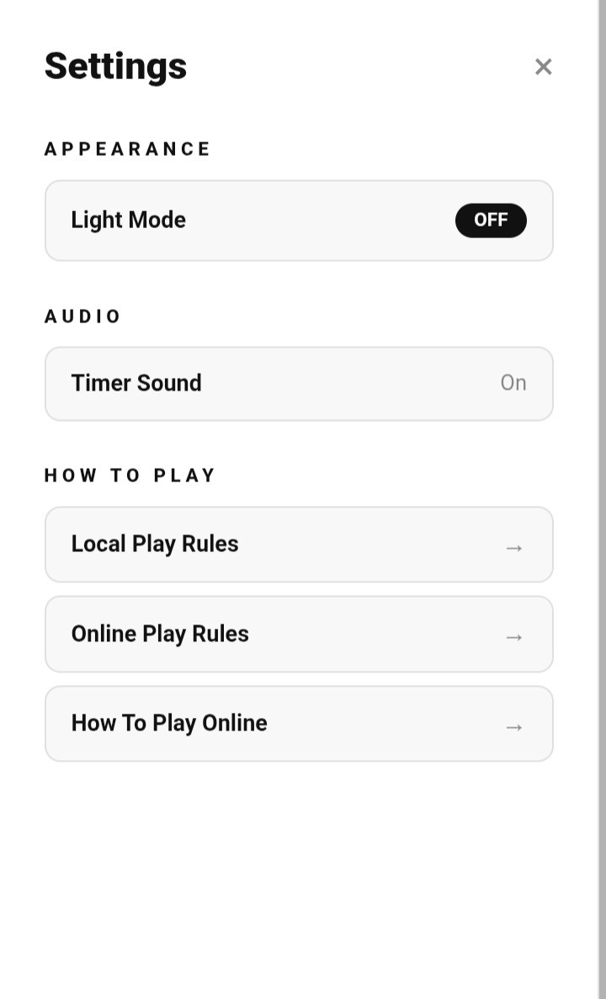

# 🎯 Truth or Dare

> A fast, fun, and social Truth or Dare game for friends and parties — play locally or challenge friends online in real time.



---

## 📱 Screenshots

| Home | Gameplay | Online Mode | Settings |
|------|----------|-------------|----------|
|  |  |  |  |

---

## ✨ Features

- 🎮 **Play Local** — Pass the phone around and take turns with friends
- 🌐 **Play Online** — Create or join a room with a code and play with friends remotely
- 👥 **Friends System** — Search for friends by username and see their online status
- ⏱️ **Timer** — Each dare comes with a countdown timer to keep things exciting
- 🏆 **Scoring** — Players earn points for completing truths and dares
- ⏭️ **Skip System** — Limited skips per game to keep it fair
- 🔔 **Notifications** — Get notified when friends invite you to a room
- 🌙 **Light / Dark Mode** — Switch between themes in settings
- 🔊 **Timer Sound** — Audio cues to keep players on track
- 📖 **How to Play** — Built-in rules for both local and online modes

---

## 🛠️ Built With

- [React](https://react.dev/) — UI framework
- [Vite](https://vitejs.dev/) — Lightning fast build tool
- [Firebase](https://firebase.google.com/) — Authentication, real-time database & online rooms
- [Node.js](https://nodejs.org/) — JavaScript runtime

---

## 🚀 Getting Started

### Prerequisites

Make sure you have the following installed:
- [Node.js](https://nodejs.org/) (v18 or higher)
- npm

### Installation

1. **Clone the repository**
   ```bash
   git clone https://github.com/powellAi/Truth-or-Dare.git
   cd Truth-or-Dare
   ```

2. **Install dependencies**
   ```bash
   npm install
   ```

3. **Set up Firebase**
   - Create a project at [firebase.google.com](https://firebase.google.com)
   - Add your Firebase config to a `.env` file:
   ```env
   VITE_FIREBASE_API_KEY=your_api_key
   VITE_FIREBASE_AUTH_DOMAIN=your_auth_domain
   VITE_FIREBASE_PROJECT_ID=your_project_id
   ```

4. **Start the development server**
   ```bash
   npm run dev
   ```

5. Open [http://localhost:5173](http://localhost:5173) in your browser

---

## 🎮 How to Play

### Local Mode
1. Add player names
2. Each turn, a player chooses **Truth** or **Dare**
3. Complete the challenge before the timer runs out
4. Earn points for completed challenges
5. Player with the most points at the end wins!

### Online Mode
1. Sign in with your account
2. Create a room or enter a friend's room code
3. Each player joins on their own device
4. Take turns answering truths and completing dares in real time

---

## 📂 Project Structure

```
Truth-or-Dare/
├── public/
│   ├── icons/
│   └── manifest.json
├── src/
│   ├── components/
│   ├── pages/
│   └── main.jsx
├── .gitignore
└── package.json
```

---

## 🤝 Contributing

Contributions, issues, and feature requests are welcome! Feel free to open an issue or submit a pull request.

---

## 👤 Author

**powellAi**
- GitHub: [@powellAi](https://github.com/powellAi)

---

## 📄 License

This project is open source and available under the [MIT License](LICENSE).
